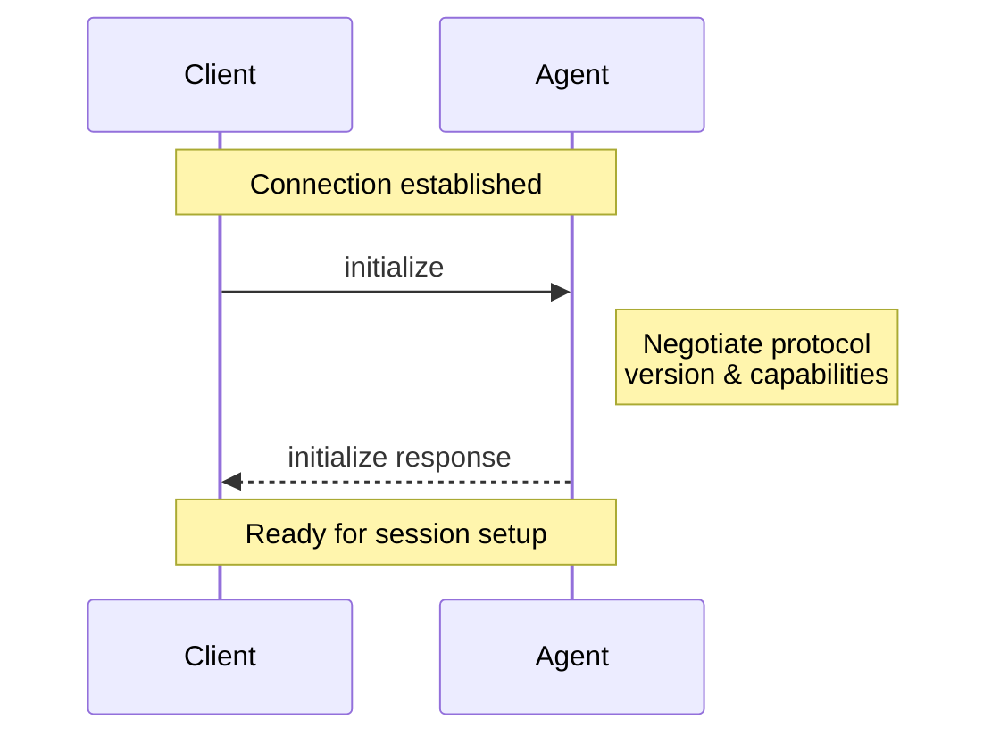
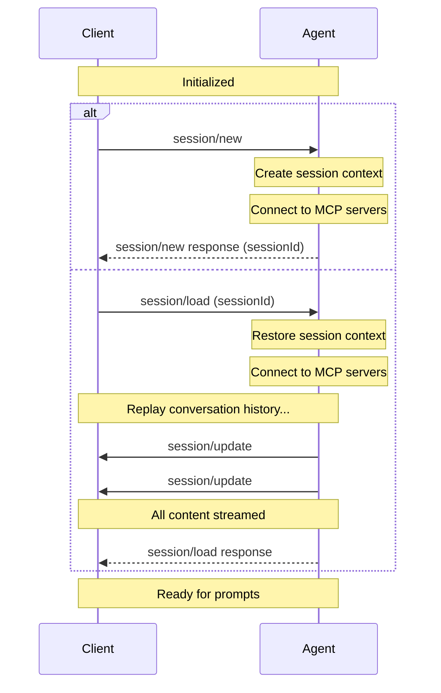
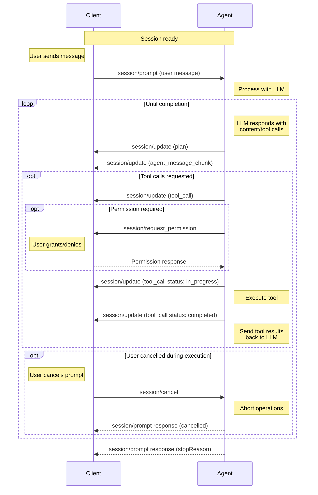

export const metadata = { 
  title: "ACP 协议：LLM 生态的标准化时代",
  date: "2026-04-01",
  description: "10分钟速通 ACP 协议",
  slug: "acp-guide"
};

import beforeACP from '../public/images/posts/acp-guide/before-acp.png'
import AionUi from  '../public/images/posts/acp-guide/AionUi.png'
import Toad from  '../public/images/posts/acp-guide/Toad.png'


## 1. ACP 是什么

[Agent Client Protocol (ACP)](https://agentclientprotocol.com/get-started/introduction) 是一项基于 [JSON-RPC 2.0](https://www.jsonrpc.org/specification) 的通信协议，旨在标准化<strong>客户端工具（Client）</strong>与<strong> AI Agent（Agent）</strong>之间的通信方式。协议的核心目标是解决当前 Agent 与各类工具间**集成成本高**和**互操作性差**的问题，使得用户可以自由组合不同的 Client 与 Agent。

## 2. 诞生

在 ACP 协议出现之前，Agent 与 IDE 之间高度耦合，痛点有：

- **M x N 集成难题**：每增加一个 IDE 或一个 Agent，都需要进行大量定制化的集成工作。
- **用户体验断裂**：用户在不同的 IDE 中，不得不面对完全不同的交互、UI 以及 IDE 相关的生态。
- **重复造轮子**：JetBrains 发现，由于行业内缺乏统一标准，不同的 Agent 甚至在 IDE 中占据着位置和颜色都极其相似的区域，这给用户带来了认知负担。

我觉得你应该看出了一些端倪，这不就是 LSP 诞生时的类似场景？

<Image src={beforeACP} alt="before-acp" />

Zed 团队在2025年初重新设计了其 Agent 面板，并开始思考如何让用户能够自由选择除官方 Agent 以外的其他 AI 工具。与此同时，JetBrains 团队也在同年7月左右开始设计类似的协议层。在 JetBrains 准备发布自己的草案时，其负责人 Sergey 在 Hacker News 上读到了关于 Zed 正在进行类似尝试的文章。为了避免行业内出现多个互不兼容的标准，Sergey 主动联系了 Zed 的 Ben，双方一拍即合，ACP 协议就此诞生。

## 3. 协议的维护和管理

ACP 协议目前由 **Zed** 和 **JetBrains** 共同治理，旨在确保该协议能够服务于更广泛的生态系统，并计划最终转型为独立的基金会。其维护和管理遵循一套类似于 Rust 基金会或其他开源项目的**分层式技术治理模型**。

## 4. 设计理念

### 4.1. MCP-friendly：兼容现有生态

ACP 协议同 MCP 协议一样基于 JSON-RPC 2.0 构建，并尽可能地重用 MCP 的数据类型，以便各种工具更好地集成 ACP 协议。

ACP 协议采用了与 MCP 协议相同的[ `ContentBlock`（内容块）](https://modelcontextprotocol.io/specification/2025-06-18/schema#contentblock)结构，使得 Agent 可以直接将 MCP 工具的输出结果转发给 IDE 显示，而无需进行任何格式转换或二次包装。此外，ACP 在 `_meta` 字段中保留了[ W3C 追踪上下文（trace context）](https://www.w3.org/TR/trace-context/)的键名，以确保与现有的 MCP 实现和 OpenTelemetry 监控工具完全兼容。MCP 已经建立起基于 JSON-RPC 的成熟生态系统以及工具链，ACP 通过复用已有的标准，**降低了集成难度并提高数据流转效率，避免重复造轮子**。
   
### 4.2. UX-first：以用户体验为核心的开发规范

既要能让用户在使用 Agent 时可以理解看清 Agent 的“意图”，又要通过具体的、有语义的、不过度抽象的规范来避免开发者在实现界面时无从下手。

这体现了 ACP 协议在设计上的平衡点。ACP 引入了丰富的语义化数据类型表示各种 Agent 行为与状态，例如：Agent Plan(Plan 模式)、Following the Agent(追踪 Agent 操作轨迹) 和 ToolKind(可调用的工具类别，例如 读/写/搜索)等。
   
虽然 ACP 复用了 MCP 的基础数据类型（如文本、图片），但它针对编程 Agent 这一特定领域增加了一些**非抽象的、具体的类型**。例如，它定义了专门用于显示代码更改的 `Diff`类型，以及用于实时流式传输 shell 命令结果的 `Terminal` 类型。

### 4.3. Trusted：受控信任下的开发体系

ACP 的安全哲学很明确：协议默认用户信任 Agent 背后的大模型，并且 Agent 的行为是受控的，用户对 Agent 对本地文件的敏感操作依然保留最终控制权。

Agent 拥有较高的权限，但它并不是完全不受控的。协议通过**权限请求机制**确保了用户的最高指挥权。Agent 在执行工具调用之前， **可以**通过调用 `session/request_permission` 方法，通过Client（IDE/ 编辑器等）向用户请求权限：

```JSON
{
  "jsonrpc": "2.0",
  "id": 5,
  "method": "session/request_permission",
  "params": {
    "sessionId": "sess_abc123def456",
    "toolCall": {
      "toolCallId": "call_001"
    },
    "options": [
      {
        "optionId": "allow-once",
        "name": "Allow once",
        "kind": "allow_once"
      },
      {
        "optionId": "reject-once",
        "name": "Reject",
        "kind": "reject_once"
      }
    ]
  }
}
```

ACP 协议通过编辑器建立了一个“受控的信任区”。它既赋予了 Agent 执行任务所需的“手”和“眼”（访问文件和 MCP 工具），又为用户保留了随时按下“停止键”或“拒绝键”的权力，从而实现了高效开发与安全受控之间的平衡。

## 5. 交互 & 生命周期

Client 与 Agent 之间的交互并不复杂，其生命周期主要分为三个阶段：**初始化（Initialization）**、**建立Session（Session Setup）** 和  **Prompt 发送与响应（Prompt Turn）**。

### 5.1. 初始化 (Initialization Phase)

这是所有 ACP 连接开始的必经阶段，主要用于双方协商协议版本、交换能力集（Capabilities）及确定身份信息。

- **协商协议版本与能力**：Client 首先调用 `initialize` 方法，发送其支持的最高**协议版本**、**Client 能力**（如文件系统访问权限、终端操作支持）以及**Client 身份信息**（名称、标题、版本）。
- **Agent 响应**：Agent 必须回应其选择的协议版本、自身支持的能力集（如是否支持加载 Session、支持哪些媒体内容、MCP 能力等）以及 Agent 身份信息。
- **身份验证（可选）**：如果 Agent 需要身份验证，Client 必须在 Session 创建前通过 `authenticate` 方法并根据初始化时通告的验证方法进行验证。



### 5.2. 建立 Session (Session Setup)

Session 代表了 Client 与 Agent 之间特定的对话上下文或线程。每个 Session 维护独立的上下文、Session 历史和状态。

- **创建新 Session (session/new)**：
	1. Client 调用 `session/new`，提供工作目录（`cwd`）和需要连接的 **MCP 服务器**列表。
	2. Agent 创建 Session 上下文，连接到指定的 MCP 服务器，并返回一个唯一的 `sessionId`。
- **加载现有 Session (session/load)**：
    1. 如果 Agent 具备 `loadSession` 能力，Client 可以调用 `session/load`。
    2. Agent 恢复 Session 上下文，连接 MCP 服务器，并以 `session/update` 通知的形式将整个**历史对话记录流式传回**给 Client。
    3. 待所有内容同步完成后，Agent 对 `session/load` 请求做出响应，Client 即可继续对话。



### 5.3. Prompt 发送与响应（Prompt Turn）

这是交互循环的核心，代表一个完整的交互周期，从用户发送消息开始，到 Agent 完成响应结束。

1. **用户消息**：Client 通过 `session/prompt` 发送包含文本、图像或资源链接的内容块。
2. **Agent 处理与实时更新**：Agent 将提示词发送给大模型（LLM），并通过 `session/update` 通知向 Client 流式传输实时进度，包括：
    - **执行计划 (Agent Plan)**：任务的执行策略和步骤。
    - **消息块**：大模型生成的文本、思考过程或内容片段。
    - **工具调用通知**：告知 Client 已启动某个工具调用。
3. **工具调用与权限请求**：
    - 如果工具操作敏感（如修改文件），Agent 会调用 `session/request_permission` **请求用户授权**。
    - 在工具运行期间，Agent 会更新工具状态（`in_progress`, `completed`, `failed`），并可利用 Client 的文件系统（`fs`）或终端能力执行操作。
4. **回合结束**：
    - 当大模型完成响应且无待处理工具调用时，Agent 向原始 `session/prompt` 请求返回一个 `stopReason`（如 `end_turn`, `max_tokens`），回合正式结束。
5. **中断与取消（可选）**：Client 可以随时发送 `session/cancel` 通知来中断正在进行的操作。Agent 收到后需尽快停止模型请求并终止工具调用，最后返回 `cancelled` 停止原因。

完成一个回合后，Client 可以再次发送 `session/prompt` 开始新的对话回合，持续构建上下文。




> [!NOTE]
> 对于关闭连接，官方文档只有在[transport章节](https://agentclientprotocol.com/protocol/transports#stdio) 的流程图提及了 Client 关闭 stdin，结束子进程。尚不明确实践中是否有其他关闭连接的方式（相关RFD正在进程中）。

## 6. 应用场景

不久前 Cursor 宣布了其与 JetBrains IDE 基于 ACP 协议的集成合作。但是 ACP 协议并不是开发工具专属的协议，一些落地案例：

### 6.1. AionUi

<Image src={AionUi} alt="AionUi" />

[**AionUi**](https://github.com/iOfficeAI/AionUi) 是一个免费、开源且跨平台的桌面应用程序，旨在为各种 Agent 提供一个统一的图形用户界面。简单来说，如果你在使用像 `Claude Code`、`Gemini CLI` 或 `Qwen Code` 这样原本只能在终端里运行的 AI 工具，AionUi 就像是为它们穿上了一层“可视化外衣”，让你能像使用普通聊天软件一样操作这些强大的 AI 工具。

核心功能与定位:
- **多 Agent 协同工作（Cowork）：** 它不仅是一个聊天窗口，更是一个“协同办公”平台。Agent 可以直接读取、写入你的本地文件，运行脚本，甚至帮你整理文件夹、生成 PPT 或处理 Excel。
- **统一的管理界面：** 自动检测并集成你电脑上已安装的各种 CLI 工具（如 Claude Code, Gemini CLI, Goose 等），让你在一个窗口里就能切换不同的 Agent 引擎。
- **本地化与隐私：** 数据存储在本地的 SQLite 数据库中，不经过第三方服务器，确保了隐私安全。
- **零配置内置引擎：** 即使你没有安装任何命令行工具，AionUi 也内置了完整的 Agent 引擎，填入 API Key 即可直接使用。
- **24/7 自动化：** 支持通过 Cron 表达式设置定时任务，让 Agent 自动执行周期性的工作流（如每日数据汇总、文件清理）。
### 6.2. Toad

<Image src={Toad} alt="Toad" />

[Toad](https://github.com/batrachianai/toad)是一个专门为 **AI 编码智能体（AI Coding Agents）** 打造的统一终端用户界面。它由 Python 知名 TUI 库 `Textual` 的作者 Will McGugan 开发，旨在解决当前各类 AI 命令行工具（如 Claude Code, Gemini CLI 等）界面不统一、交互体验差的问题。

Toad 的设计理念非常独特：它认为目前的 AI 智能体就像是“自带浏览器的网站”，每个工具都有自己的输入输出逻辑。Toad 则试图成为一个**通用的前端**，通过 **ACP** 协议连接各种不同的 AI 引擎。

主要功能特性：

- **多模型/ Agent 集成**：支持 Claude、Gemini、Codex、OpenHands 等多种智能体。你可以从 Toad 的应用商店界面直接发现、安装并运行这些插件。
- **极佳的终端交互（TUI）**：
    - **富文本渲染**：支持 Markdown 实时流式渲染，能够漂亮地展示代码块（带语法高亮）、表格和列表。 
    - **模糊文件检索**：输入 `@` 符号即可唤起文件选择器，支持根据 `.gitignore` 自动过滤，方便将项目文件快速加入 AI 上下文。
    - **丝滑的 Shell 集成**：你可以直接在对话中通过 `!` 前缀执行 Shell 命令。与普通工具不同，Toad 支持全彩输出和交互式命令（甚至可以在 Toad 里面运行另一个 TUI 工具）。
- **Prompt 编辑器**：内置了一个支持语法高亮、选择、剪切/粘贴和完整鼠标操作的 Markdown 编辑器，体验接近图形化 IDE。
- **并发 Session**：支持同时运行多个 AI 会话，并可在不同供应商之间切换。

## 7. ACP 开发集成

如果想在应用程序中集成 ACP 协议实现的标准化功能，请查阅 [agentclientprotocol 官方 repo](https://github.com/orgs/agentclientprotocol/repositories?type=all)。官方 GitHub 仓库分别提供了 [Kotlin](https://github.com/agentclientprotocol/kotlin-sdk)、[Java](https://github.com/agentclientprotocol/java-sdk)、[Python](https://github.com/agentclientprotocol/python-sdk)、[Rust](https://github.com/agentclientprotocol/rust-sdk) 和[Typescript](https://github.com/agentclientprotocol/typescript-sdk) 的 SDK。

## 8. RFD (Requests for Dialog)

RFD 是 ACP 版本的 RFC 流程。RFD 是提出新功能、收集社区对某个问题的意见以及记录设计决策的主要机制。

目前已完成的 RFD：

| 已完成 RFD                                                                               | 主题                                                                                                                                     |
| ------------------------------------------------------------------------------------- | -------------------------------------------------------------------------------------------------------------------------------------- |
| [Introduce RFD Process](https://agentclientprotocol.com/rfds/introduce-rfd-process)   | 引入 RFD 的流程，用结构化的、对社区友好的设计文档取代临时设计讨论，跟踪功能从概念到完成的整个过程。                                                                                   |
| [Session Config Options](https://agentclientprotocol.com/rfds/session-config-options) | 允许 Agent 为给定 Session 提供任意配置选择器列表。除了模式与模型外，还可以让每个 Agent 更灵活地指定允许 Client 向用户提供的配置。                                                       |
| [Session List](https://agentclientprotocol.com/rfds/session-list)                     | 为 ACP 协议添加 `session/list` 接口，允许 Client 从 Agent 查询并枚举现有 Session，从而实现 Session 历史、Session 切换和 Session 清理等 Session 管理功能。                   |
| [Session Info Update](https://agentclientprotocol.com/rfds/session-info-update)       | 在现有的 `SessionUpdate` 通知类型中增加 `session_info_update` 变体，允许 Agent 更新 Session 元数据（特别是标题/名称），从而在无需新增接口的情况下，实现  Client UI 中 Session 标识的动态更新。 |
| [ACP Agent Registry](https://agentclientprotocol.com/rfds/acp-agent-registry)         | ACP 需要一个统一且可信的 Agent 注册表，以便 Client 能够发现集成、了解其功能并自动配置。                                                                                  |

部分重要的 RFD 草案：

| RFD 草案                                                                                            | 主题                                                                                                                          |
| ------------------------------------------------------------------------------------------------- | --------------------------------------------------------------------------------------------------------------------------- |
| [Forking of existing sessions](https://agentclientprotocol.com/rfds/session-fork)                 | 新增基于现有 Session 创建新 Session 分支的功能。使得我们能够利用当前对话作为上下文来生成 PR 的描述、摘要等信息，而不会污染用户历史记录。                                             |
| [Request Cancellation Mechanism](https://agentclientprotocol.com/rfds/request-cancellation)       | 受 LSP 启发，引入请求取消机制，以实现更细粒度的请求取消，其中可以逐个取消单个 JSON-RPC 请求。                                                                      |
| [Resuming of existing sessions](https://agentclientprotocol.com/rfds/session-resume)              | 新增恢复现有 Session 的功能。这类似于“session/load”命令。                                                                                    |
| [MCP-over-ACP: MCP Transport via ACP Channels](https://agentclientprotocol.com/rfds/mcp-over-acp) | 新增对通过 ACP 通道的 MCP 服务器的支持。使得任何 ACP 组件都能通过现有的 ACP 连接提供 MCP 工具并处理回调，而无需生成单独的进程或管理额外的传输方式。                                      |
| [Session Usage and Context Status](https://agentclientprotocol.com/rfds/session-usage)            | 引入标准化的用量与上下文窗口追踪机制，使 Agent 能够以统一的方式报告 Token 消耗、成本估算以及上下文窗口利用率，从而确保不同实现方案之间的一致性。                                             |
| [Authentication Methods](https://agentclientprotocol.com/rfds/auth-methods)                       | 新增更多关于 Agent 支持的身份验证方法的信息，使得 Client 渲染更合适的 UI 界面。                                                                           |
| [Logout Method](https://agentclientprotocol.com/rfds/logout-method)                               | 新增 `logout` 方法，允许 Client 终止与 Agent 的已认证 Session。此方法与现有的 `authenticate` 方法相对应，可实现正确的 Session 清理和认证失效机制。                      |
| [Session Delete](https://agentclientprotocol.com/rfds/session-delete)                             | 新增一个关于权限控制的 `session/delete` 方法，允许 Client 从 `session/list` 中删除会话。完善 `session/list` 功能，使用户能够控制哪些 Session 显示在其 Session 历史记录中。 |

## 9. 贡献

官方提供了以下交流渠道：

- **[Zulip](https://agentclientprotocol.zulipchat.com/)**: 实时或临时讨论。
- **[RFDs](https://agentclientprotocol.com/rfds/about)**: 对规范进行拟议更改。
- **[GitHub Discussions](https://github.com/orgs/agentclientprotocol/discussions)**: 结构化、长篇幅的讨论。
- **[GitHub Issues](https://github.com/agentclientprotocol/agent-client-protocol/issues)**: 提交可执行事项、Bug 报告和新功能请求。

## 10. 未来

在 LLM 的生态圈每天都在“革命”的今天，我们面对无尽可能的蓝海。每一个 AI 厂商为了保护自身利益，都在通过“占领”生态圈的某个制高点来赢得绝对竞争力。但是无数开源技术也证明了：**开放的、包容的生态才是推动技术发展的动力**。

ACP 协议的出现预示着 LLM 相关的生态走向标准化，LLM 发展进程中的方法论和最佳实践最终都会走向标准化。**Zed 和 JetBrains 的共同决定也印证了拥抱开放生态是技术发展的正确道路**。

---

## 相关链接

- [ACP 官方文档](https://agentclientprotocol.com/get-started/introduction)
- [ACP 官方 Repo](https://github.com/orgs/agentclientprotocol/repositories)
- [ACP 协议：AI Agent 开发的"即插即用"时代](https://pines-cheng.github.io/blog/#/posts/175)